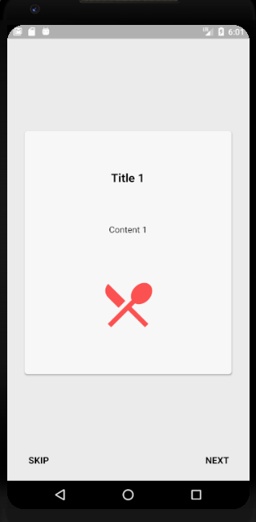
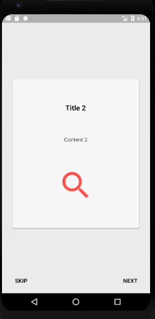
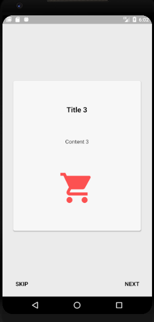

# flutterwalkthrough

A new Flutter package for both android and iOS which helps developers in creating animated walkthrough of their app.

## Screenshots

   

## Usage
[Example](https://github.com/siraiwaqarali/Flutter-Walkthrough/blob/master/example/example_app.dart)

To use this package:

* add the dependency to your [pubspec.yaml](https://github.com/siraiwaqarali/Flutter-Walkthrough/blob/master/pubspec.yaml) file.

```yaml
    dependencies:
      flutter:
        sdk: flutter
      walkthrough:
```

### How to use

```dart
    class TestScreen extends StatelessWidget {

      /*here we have a list of walkthroughs which we want to have,
      each walkthrough has a title, content and an icon
      */
      final List<Walkthrough> list = [
        Walkthrough(
          title: "Title 1",
          content: "Content 1",
          imageIcon: Icons.restaurant_menu,
        ),
        Walkthrough(
          title: "Title 2",
          content: "Content 2",
          imageIcon: Icons.search,
        ),
        Walkthrough(
          title: "Title 3",
          content: "Content 3",
          imageIcon: Icons.shopping_cart,
        ),
        Walkthrough(
          title: "Title 4",
          content: "Content 4",
          imageIcon: Icons.verified_user,
        ),
      ];

      @override
      Widget build(BuildContext context) {
        //here we need to pass the list and route for the next page to be opened after this
        return IntroScreen(
          list,
          MaterialPageRoute(builder: (context) => TestScreen()),
        );
      }
    }
```

## License & Copyright

MIT License

Copyright (c) 2020 Waqar Ali Siyal

Permission is hereby granted, free of charge, to any person obtaining a copy
of this software and associated documentation files (the "Software"), to deal
in the Software without restriction, including without limitation the rights
to use, copy, modify, merge, publish, distribute, sublicense, and/or sell
copies of the Software, and to permit persons to whom the Software is
furnished to do so, subject to the following conditions:

The above copyright notice and this permission notice shall be included in all
copies or substantial portions of the Software.

THE SOFTWARE IS PROVIDED "AS IS", WITHOUT WARRANTY OF ANY KIND, EXPRESS OR
IMPLIED, INCLUDING BUT NOT LIMITED TO THE WARRANTIES OF MERCHANTABILITY,
FITNESS FOR A PARTICULAR PURPOSE AND NONINFRINGEMENT. IN NO EVENT SHALL THE
AUTHORS OR COPYRIGHT HOLDERS BE LIABLE FOR ANY CLAIM, DAMAGES OR OTHER
LIABILITY, WHETHER IN AN ACTION OF CONTRACT, TORT OR OTHERWISE, ARISING FROM,
OUT OF OR IN CONNECTION WITH THE SOFTWARE OR THE USE OR OTHER DEALINGS IN THE
SOFTWARE.

## Getting Started


This project is a starting point for a Dart
[package](https://flutter.dev/developing-packages/),
a library module containing code that can be shared easily across
multiple Flutter or Dart projects.

For help getting started with Flutter, view our 
[online documentation](https://flutter.dev/docs), which offers tutorials, 
samples, guidance on mobile development, and a full API reference.
